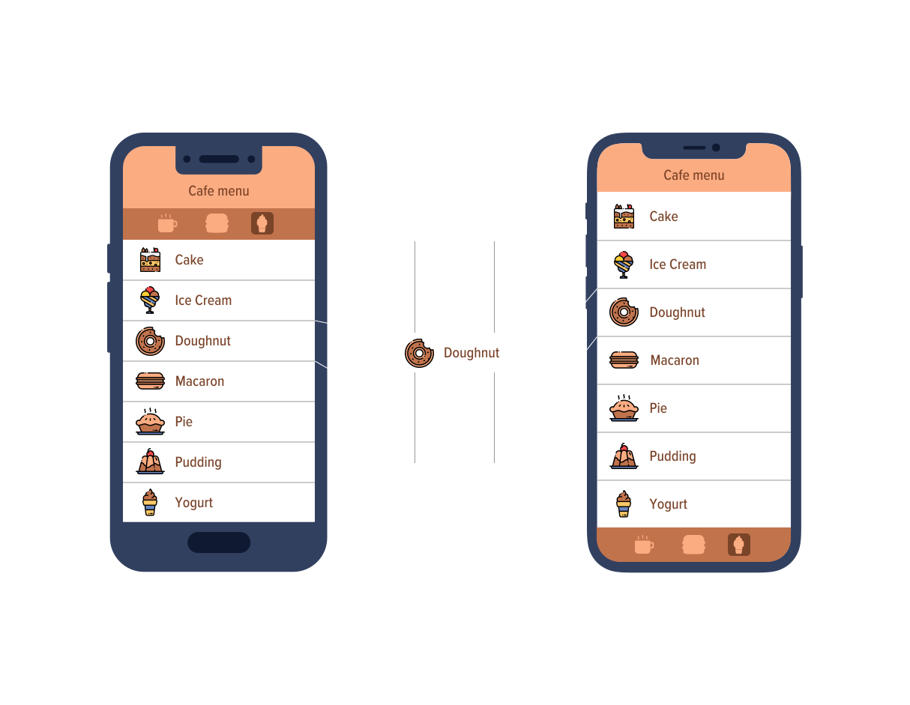

# REACT NATIVE
React Native uses the react's same declarative UI paradigm but renders directly to native components.
Instead of rendering this component to DOM, React Native renders it for you using a concept called the **entry point**.

By using React, you can reuse prior web development knowledge to create mobile with the native features of traditional mobile apps. It also allows developers to share most of the code on all platforms, resulting in faster development. But, to get from idea to app, basic knowledge of the native platforms is required.

 Even though each platform uses different elements, such as ViewGroup in Android vs. UIView in iOS, you only need to write the code once in JavaScript.
 

