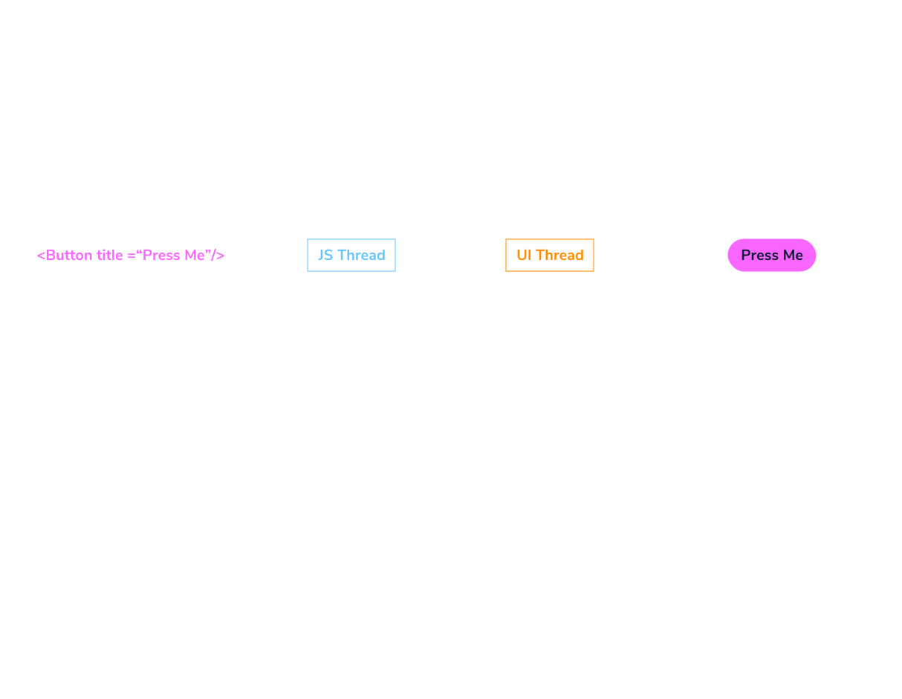

# REACT NATIVE
React Native uses the react's same declarative UI paradigm but renders directly to native components.
Instead of rendering this component to DOM, React Native renders it for you using a concept called the **entry point**.

Entry Point
All functionality of the React Native app must be included in a single React component, exported as default from the entry point file. ( e.g. App.js)

By using React, you can reuse prior web development knowledge to create mobile with the native features of traditional mobile apps. It also allows developers to share most of the code on all platforms, resulting in faster development. But, to get from idea to app, basic knowledge of the native platforms is required.

<<<<<<< HEAD
Core Components
Core components are ready-to-use components available from React Native, which include <View>, <Text>, <Image>, <ScrollView>, <Button>, and <TextInput>.

Native Components
Native components are platform-backed components. These components are invoked with JavaScript using React components. At runtime, React Native creates the corresponding Android and iOS views.

Even though each platform uses different elements, such as ViewGroup in Android vs. UIView in iOS, you only need to write the code once in JavaScript.

We use core components and react native translates them into native components.
By creating components and rendering them, you tell React Native what to render. The JavaScript with the components is bundled in your app and executed in a separate thread from the native UI. This JS thread instructs React Native what it needs to render. Splitting this into a JS thread and a UI thread allows the platform to understand what needs to be rendered without blocking the actual interface components.

To visualize these two threads, consider a highway with only a single lane for traffic. With both slow and fast traffic combined on this lane, some traffic might slow down others. Adding another lane allows the faster traffic to run independently of the slower traffic. While JS isn’t necessarily slow traffic, it can still block the UI thread and cause stuttering in visible animations.

Besides the visible UI components, the native UI thread is also handling native API requests. Some functionality, like GPS location, needs to be requested from the native APIs. If your JS code uses this kind of functionality, it interacts with the native API using native code. The data from this native code is sent back to the JS code and handled in your app.

=======
 Even though each platform uses different elements, such as ViewGroup in Android vs. UIView in iOS, you only need to write the code once in JavaScript.
 

>>>>>>> 611ef800a881e85c986ffdba446275dcedf351f7

React Native's drawback
-Pure native apps have a higher performance ceiling compared to Expo and React Native apps.
-React Native are abstractions on top of the native platform. They need to follow the latest changes and functionality from the native platforms.
-Complex apps often require you to optimize and customize native code— that requires a good understanding of every platform you need to support.
