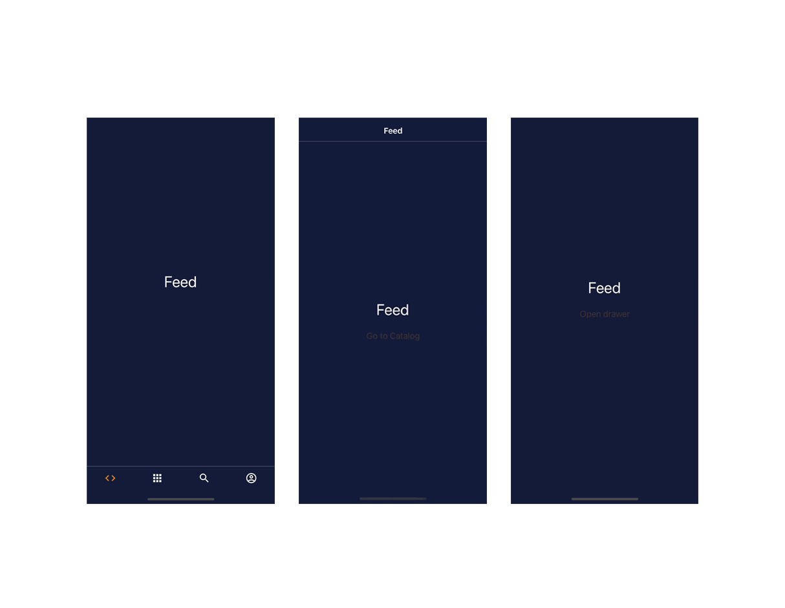

# REACT NATIVE
React Native uses the react's same declarative UI paradigm but renders directly to native components.
Instead of rendering this component to DOM, React Native renders it for you using a concept called the **entry point**.

Entry Point
All functionality of the React Native app must be included in a single React component, exported as default from the entry point file. ( e.g. App.js)

By using React, you can reuse prior web development knowledge to create mobile with the native features of traditional mobile apps. It also allows developers to share most of the code on all platforms, resulting in faster development. But, to get from idea to app, basic knowledge of the native platforms is required.

Core Components
Core components are ready-to-use components available from React Native, which include View, Text, Image, ScrollView, Button, and TextInput. More =>[DOCS](https://reactnative.dev/docs/components-and-apis)


Native Components
Native components are platform-backed components. These components are invoked with JavaScript using React components. At runtime, React Native creates the corresponding Android and iOS views.

Even though each platform uses different elements, such as ViewGroup in Android vs. UIView in iOS, you only need to write the code once in JavaScript.


We use core components and react native translates them into native components.
By creating components and rendering them, you tell React Native what to render. The JavaScript with the components is bundled in your app and executed in a separate thread from the native UI. This JS thread instructs React Native what it needs to render. Splitting this into a JS thread and a UI thread allows the platform to understand what needs to be rendered without blocking the actual interface components.

To visualize these two threads, consider a highway with only a single lane for traffic. With both slow and fast traffic combined on this lane, some traffic might slow down others. Adding another lane allows the faster traffic to run independently of the slower traffic. While JS isn’t necessarily slow traffic, it can still block the UI thread and cause stuttering in visible animations.

Besides the visible UI components, the native UI thread is also handling native API requests. Some functionality, like GPS location, needs to be requested from the native APIs. If your JS code uses this kind of functionality, it interacts with the native API using native code. The data from this native code is sent back to the JS code and handled in your app.


React Native's drawback
-Pure native apps have a higher performance ceiling compared to Expo and React Native apps.
-React Native are abstractions on top of the native platform. They need to follow the latest changes and functionality from the native platforms.
-Complex apps often require you to optimize and customize native code— that requires a good understanding of every platform you need to support.


## Core components
View component
One of the most fundamental core components is the View component. With View, you can create responsive layouts using flexbox or add basic styling to nested components.

The component is best comparable with a div HTML element. Just like div, the View component is not visible unless styling is applied. We can apply this styling through the style property.

Instead of writing display: flex, all components are a flexbox by default. We can enable the flexbox behavior by using the flex property in our style object.

React Native doesn’t use CSS. This method of styling is not available on native platforms. Instead of using CSS, we can write our styling using plain JavaScript objects. These objects use the same CSS properties but they are written in “camelCase”.

Text component
To render text on Android and iOS, the string needs to be wrapped in a Text component.

Image component
This content can be rendered in React Native using the Image component. It’s similar to the img HTML element, but the Image component has more features.
One of the additional features of Image is the ability to load images from different sources. This could be a publicly accessible https:// link, local file:// reference, Base64-encoded string, or image imported as module with require. Each of the image sources has its own benefits.

ScrollView component
ScrollView allows us to fully manage and customize how the content should be scrolled.

Button component
To capture the user clicking the button, we need to use the onPress event handler.

TextInput component
The TextInput component is created to capture textual and numeric input. This component is best comparable with the input HTML element.
To listen to input changes from the user, we can use the onChangeText event handler.
TextInput has a lot of functionality, one of them is the secureTextEntry property.

Combining components
Custom reusable components


## Accessibility in React Native
Accessibility properties
In React Native, we can add a textual description without actually displaying the text. This text helps accessibility readers communicate the action that will be performed when pressing the button. We can do that by defining the accessibility properties.  
Without the text displayed, it will read out.

```
<TouchableOpacity
  onPress={deleteItem}
  accessible={true}
  accessibilityLabel="Press to delete"
  accessibilityHint="The item will be deleted permanently"
>
  <TrashIcon />
</TouchableOpacity>
```

1. accessible -This property tells React Native to group the content into a single selectable component. When users tap the button, Android and iOS will select everything from the touchable opacity.
2. accessibilityLabel - This describes how users can use the button. Accessibility readers will tell the user to “Press to delete”.
3. accessibilityHint - This optional description tells users what will happen after pressing the button.

Design
Good high contrast

 [Google accessibility tips](https://developers.google.com/billions)
 [Other tips](https://www.youtube.com/watch?v=S3DzcCrEGbc)


##STYLING
In order to use React code and run them in a native environment, React Native uses a JavaScript thread. Since we are tied to JavaScript, we have to define our styling in JavaScript too.

StyleSheets
With the StyleSheet API, we can pull the inline styling from our components. By doing that we can reuse the styling rules.
The most important method of the StyleSheet API is the .create method. With that, we can create a nested object with styling rules and refer to the styling rules.
ome styling properties require objects instead of plain numbers or strings.
shadowOffset is one of these properties: it requires an object with width and height.
Using array with conditionally added styles, we can make the styling dynamic based on user interaction.

Width and Height
React Native doesn’t always use units, like pixels (px), when setting dimensions or font sizes. That’s because using pixels in mobile apps will cause a lot of deviations when running the app on older and newer devices.

Older phones usually have screens with lower precision or pixels per inch. Lower precision means that the screen has fewer pixels available to control. When using pixels on older devices, you content might appear larger than intended compared to newer devices with higher precision.
In mobile development, it’s common to use a different type of unit called “Density-independent Pixels” or dp. The dp unit takes the screen precision into account when setting the actual amount of pixels. This unit type is also the default unit for React Native when setting styling properties, such as height, width, and fontSize.

Some styling properties, like width and height, also accept percentage values. This format doesn’t have the same pixel-related limitation because it’s a relative value. If you have a parent view with a total width of 500dp, using 50% is relative to these density-independent pixels.

Flexbox
By adding the flex property with a factor number, we tell React Native to distribute the available space by the factor provided. The height for each of our boxes is calculated by dividing the available space by the sum of factors used. In our case, that would be height / (1 + 1 + 1) * factor.
You can also change the factor for one or two child elements. Doing so will increase the height of that element, and decrease the height of others.
This happens because we increase the factor for that element.

The flex: 1 child elements will receive height / (1 + 2 + 1) * 1, which is 25% of the available space.
The flex: 2 child element will receive height / (1 + 2 + 1) * 2, which is 50% of the available space.


##Navigation
3 different type of patterns:
- Tab Navigation - This pattern uses a tab bar to allow users to switch between screens. Usually, these screens contain different functionality, like a home screen and a profile screen. There are more variants of the tab navigator, like Google’s Material Design (top) Tabs. The tabs usually contain the primary functionality of an app, like a feed and profile screen.

- Stack Navigation - The second example is a stacked pattern. Instead of using a menu or tab bar, the user has to go from screen to screen to navigate through all screens. When a user navigates from one screen to another, the screen is pushed on a stack. The order of the stack doesn’t matter; every transition is another screen in the stack. However when going back a page, the last screen is removed from the stack and the previous screen is displayed. These stacks usually contain screens that are functional-related to each other, like a list of tasks and a task detail screen.

- Drawer Navigation - Instead of using a tab bar, it uses a pane that can be opened by either swiping or opening a menu button. In this pane, there is a menu where the users can switch between screens. Like the tab bar pattern, these screens often contain the primary functionality of your app.


The concept of sketching out the navigational structure of your app is often referred to as **navigation hierarchy**. In its simplest form, you can draw the structure as a simple graph. Every node represents a screen, and the edges define how the user can navigate from screen to screen.

In plain React, there is no concept of rendering different pages. It only renders the default entrypoint, which is just a single React component. This also applies to React Native. Everything in your app has to be handled within that single component. Managing transitions between multiple screens can be a complex task.

One of the core principles of **react-navigation** is the navigator. It’s the fundamental structure that holds multiple screens of your app. The navigator determines what screen should render and how transitions between multiple screens are animated. All of the screens are identified and referred to by a unique name.

react-navigation ships with a couple of different navigators, each following one of the navigational patterns you saw earlier:
- Tab Navigator - Renders a tab menu where users can switch between multiple screens. These screens are only rendered when navigated to.
- Stack Navigator - Renders a header with the screen title and optional back buttons when users navigate other screens.
- Drawer Navigator - Renders a sidebar list menu where users can switch between multiple screens. Users can open the menu by swiping from the side of the screen.

To refactor our app into screens, we have to define the current App content as a screen. We use the stack navigator for this single screen to get familiar with the concept of navigators.

Navigators in react-navigation are created by a factory method. The stack navigator is created by the **createStackNavigator**. This method returns an object with a Navigator and Screen property. These properties are unique components that you have to use when rendering the screens.

```
const Stack = createStackNavigator();
 
<Stack.Navigator>
  <Stack.Screen name="MyScreen" component={MyScreen} />
</Stack.Navigator>
```

Programmatic Navigation
With the tab or drawer navigator, you get a customizable menu that users can use to navigate between screens. The stack navigator only adds a menu with the screen title and a back button once you navigate within the stack. To navigate to different screens within the stack, we have to implement our code to move users from one screen to another.
Every screen receives a navigation property. This property is an object with a lot of useful methods, like .navigate('ScreenName') or .goBack().

```
// Using properties, only available in screen components
const FeedScreen = (props) => {
  const nav = props.navigation;
 
  return (
    <Button
      title="Go to home"
      onPress={() => nav.navigate('Home')}
    />
  );
};
```

You can also access this navigation object using the useNavigation hook.
```
/ Using the hook, available in all components
const HomeButton = () => {
  const nav = useNavigation();
 
  return (
    <Button
      title="Go to home"
      onPress={() => nav.navigate('Home')}
    />
  );
};
```

 We don’t have to use the stack navigator to interact with the navigation API - it works with all navigators. Navigating within a stack requires manual transitions because we don’t get a menu with the stack navigator.

 Nested Navigation
To help you structure more complex use cases, you can combine multiple navigators. Instead of rendering a screen, you can also render a navigator as a screen. Nesting navigators sounds simple, but you have to be careful when doing so. When rendering a stack navigator inside another stack navigator, you might get two headers on top. To fix that, you can customize or turn off the header in one stack navigator.

EX.
we want to add a stack navigator to the profile tab. Here, we show an overview screen and a settings screen. The settings screen shouldn’t be a tab on its own. By adding this stack navigator, we group the profile functionality under a single tab. It also adds a nice screen animation when users go to the settings screen and keeps the profile tab marked as active.


Authentication Flow
Instead of using a stack navigator within a tab navigator, we will add a stack navigator as our first navigator.
